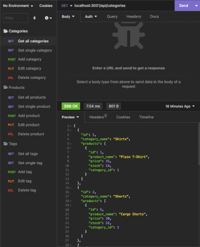
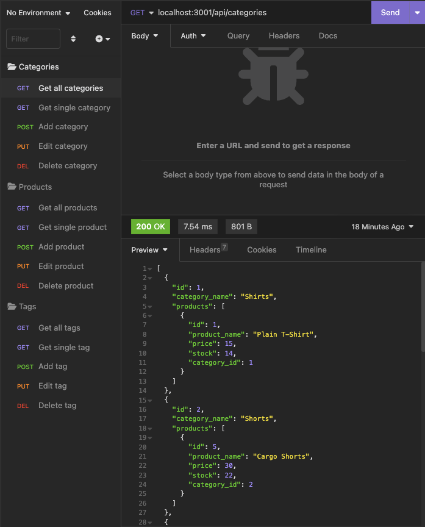
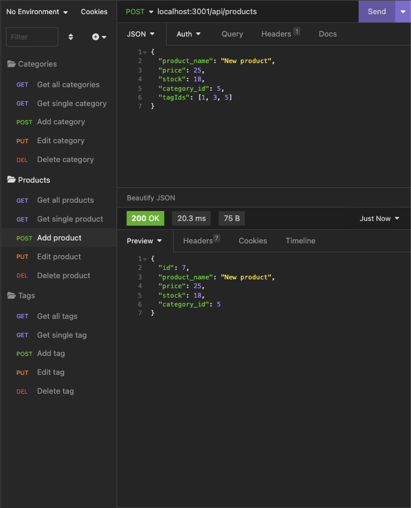
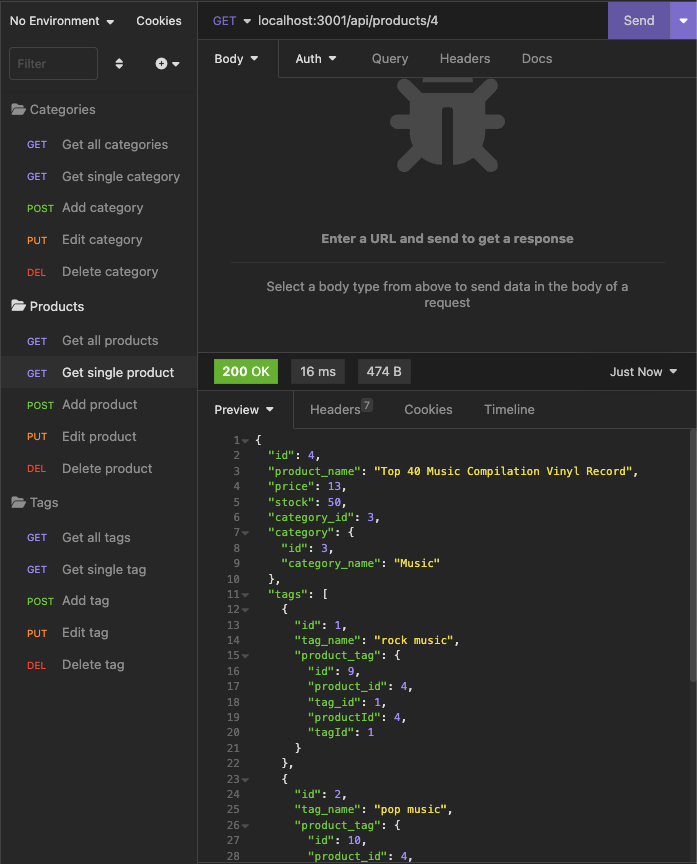
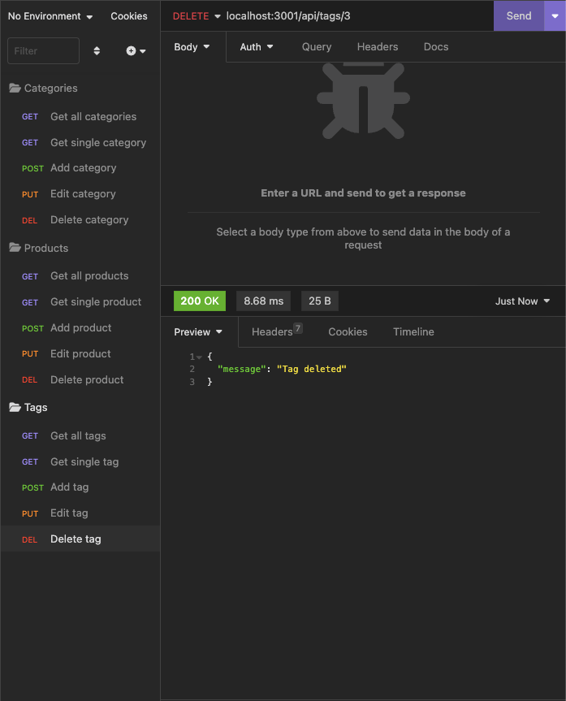

# E-Commerce Back End 

## Description

The E-Commerce Back End is a relational database that allows a user to interact with a database of products, categories and tags. The user has lookup, creation, editing and deletion abilities through the interface. Though this back end could be accessed via a web browser with a front end created for the purpose, it's just as easy to use a utility like [Insomnia](https://insomnia.rest) to interact with it as well.

I needed a quicker way to interact with the back-end data. Something not as polished and limiting as a web front end, but more convenient than using the CLI. So I created this!

A walkthrough video demonstrating the capabilities of the software is available [here](https://drive.google.com/file/d/12H1SUPp5Dt2KasaDJFmFtTwXFm-DGPnV/view?usp=sharing).

## Table of Contents

* [Installation Instructions](#installation-instructions)
* [Usage Information](#usage-information)
* [Credits](#credits)
* [Software License](#software-license)
* [Contact the Developer](#contact-the-developer)

## Installation Instructions

The E-Commerce Back End is a Node.js application that interfaces with a mysql database and utilizes Express as the server architecture. All Node module dependencies are either installed using npm ("npm i" in the directory that houses the application) or included with the source files. You must have Node.js and MySQL installed on the server where you intend to house the application.

## Usage Information

Once the E-Commerce Back End is installed, a user can create the empty database by running the db/schema.sql file at his mysql prompt. Optionally, if they would like to play with dummy data, they can run "node seeds/index" on their CLI from the installation directory. To turn on the server, run "npm start" from the CLI.

Utilizing [Insomnia](https://insomnia.rest) or some similar tool to interface with the server, the user can go to the folling paths to accomplish these actions. The application defaults to port 3001, but can be routed through any port of the user's wishes:

* Categories: http://[host]:[port]/api/categories/[id]
* Products: http://[host]:[port]/api/products/[id]
* Tags: http://[host]:[port]/api/tags/[id]

Use a GET request at each path to get information on all categories, products or tags by leaving off the optional id, or get information on just one category, product or tag by using its id number.

Use a POST request at each path (with non id) to post a new category, product or tag. The body of your post should include:

* For categories, { category_name: [text] }
* For tags, { tag_name: [text] }
* for products, { product_name: [text], price: [decimal], stock: [integer], category_id: [integer], tagIds: [array of integers] }

Use a PUT request paired with an item's id to edit a given item, including a similar object as above reflecting the item's new contents.

Use a DELETE request paired with an item's id to delete the item.

## Credits

All code for the E-Commerce Back End was written by Lee Klusky, based on existing technologies Node.js, Express, MySql, Sequelize and others. The authors and contributors of those packages made this application possible.

I also could not have written this app without the guidance and help of the instructional staff of the University of Minnesota Full Stack Coding Boot Camp, as well as the wisdom of the coders and commentors from around the Web at places like [Stack Overflow](http://www.stackoverflow.com), the [Mozilla Developer Network(http://developer.mozilla.org), and [W3Schools](http://www.w3schools.com).

## Software License

©2023, Lee Klusky

This software is covered by a [MIT License](https://opensource.org/licenses/MIT).

Permission is hereby granted, free of charge, to any person obtaining a copy of this software and associated documentation files (the "Software"), to deal in the Software without restriction, including without limitation the rights to use, copy, modify, merge, publish, distribute, sublicense, and/or sell copies of the Software, and to permit persons to whom the Software is furnished to do so, subject to the following conditions:

The above copyright notice and this permission notice shall be included in all copies or substantial portions of the Software.

THE SOFTWARE IS PROVIDED "AS IS", WITHOUT WARRANTY OF ANY KIND, EXPRESS OR IMPLIED, INCLUDING BUT NOT LIMITED TO THE WARRANTIES OF MERCHANTABILITY, FITNESS FOR A PARTICULAR PURPOSE AND NONINFRINGEMENT. IN NO EVENT SHALL THE AUTHORS OR COPYRIGHT HOLDERS BE LIABLE FOR ANY CLAIM, DAMAGES OR OTHER LIABILITY, WHETHER IN AN ACTION OF CONTRACT, TORT OR OTHERWISE, ARISING FROM, OUT OF OR IN CONNECTION WITH THE SOFTWARE OR THE USE OR OTHER DEALINGS IN THE SOFTWARE.

## Questions?

Contact me at <a href="mailto:lkbootcamp@yahoo.com">lkbootcamp@yahoo.com</a>, or visit my [GitHub profile](https://www.github.com/lkalliance).
